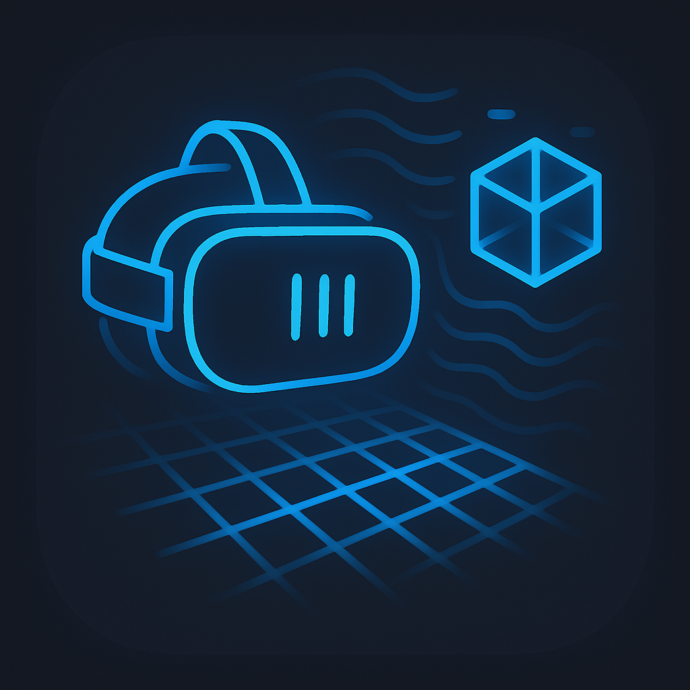

# QuestRealityCapture

<p align="center">
  
</p>

**Capture and store real-world data on Meta Quest 3 or 3s, including HMD/controller poses, stereo passthrough images, camera metadata, and depth maps.**

---

## 📖 Overview

`QuestRealityCapture` is a Unity-based data logging app for Meta Quest 3. It captures and stores synchronized real-world information such as headset and controller poses, images from both passthrough cameras, camera characteristics, and depth data, organized per session.

---

## ✅ Features

* Records HMD and controller poses (in Unity coordinate system)
* Captures **YUV passthrough images** from **both left and right cameras**
* Logs **Camera2 API characteristics** and image format information
* Saves **depth maps** and **depth descriptors** from both cameras
* Automatically organizes logs into timestamped folders on internal storage

---

## 🧾 Data Structure

Each time you start recording, a new folder is created under:

```
/sdcard/Android/data/com.t34400.QuestRealityCapture/
```

Example structure:

```
/sdcard/Android/data/com.t34400.QuestRealityCapture/
└── YYYYMMDD_hhmmss/
    ├── hmd_poses.csv
    ├── left_controller_poses.csv
    ├── right_controller_poses.csv
    │
    ├── left_camera_raw/
    │   ├── <unixtimeMs>.yuv
    │   └── ...
    ├── right_camera_raw/
    │   ├── <unixtimeMs>.yuv
    │   └── ...
    │
    ├── left_camera_image_format.json
    ├── right_camera_image_format.json
    ├── left_camera_characteristics.json
    ├── right_camera_characteristics.json
    │
    ├── left_depth/
    │   ├── <unixtimeMs>.raw
    │   └── ...
    ├── right_depth/
    │   ├── <unixtimeMs>.raw
    │   └── ...
    │
    ├── left_depth_descriptors.csv
    └── right_depth_descriptors.csv
```

---

## 📄 Data Format Details

### Pose CSV

* Files: `hmd_poses.csv`, `left_controller_poses.csv`, `right_controller_poses.csv`
* Format:

  ```
  unix_time,ovr_timestamp,pos_x,pos_y,pos_z,rot_x,rot_y,rot_z,rot_w
  ```

### Camera Characteristics (JSON)

* Obtained via Android Camera2 API
* Includes pose, intrinsics (fx, fy, cx, cy), sensor info, etc.

### Image Format (JSON)

* Includes resolution, format (e.g., `YUV_420_888`), per-plane buffer info
* Contains baseMonoTimeNs and baseUnixTimeMs for timestamp alignment

### Passthrough Camera (Raw YUV)
- Raw YUV frames are stored as `.yuv` files under `left_camera_raw/` and `right_camera_raw/`.
- Image format and buffer information are provided in the accompanying `*_camera_image_format.json` files.

Instructions for converting `YUV_420_888` images to RGB will be documented later.

### Depth Map Descriptor CSV

* Format:

  ```
  timestamp_ms,ovr_timestamp,create_pose_location_x, ..., create_pose_rotation_w,
  fov_left_angle_tangent,fov_right_angle_tangent,fov_top_angle_tangent,fov_down_angle_tangent,
  near_z,far_z,width,height
  ```

### Depth Map

* Raw `.float32` depth images (1D float per pixel)

Conversion to 3D coordinates will be documented later.

---

## 🚀 Installation & Usage

1. Download the APK from [GitHub Releases](https://github.com/t-34400/QuestRealityCapture/releases)
2. Install with ADB:

   ```bash
   adb install QuestRealityCapture.apk
   ```
3. Launch the app on **Meta Quest 3 or 3s** (firmware **v74+** required)
4. When the green instruction panel appears, press the **menu button on the left controller** to dismiss it and start logging
5. Data will be saved under the session folder as described above

Required permissions (camera/scene access) are requested automatically at runtime.

---

## 🛠 Environment

* Unity **6000.0.30f1**
* Meta OpenXR SDK
* Device: Meta Quest 3 or 3s only
* Approx. recording frame rate: \~25 FPS (camera & depth)

---

## 📝 License

This project is licensed under the **[MIT License](LICENSE)**.

This project uses Meta’s OpenXR SDK — please ensure compliance with its license when redistributing.

---

## 📌 TODO

* [ ] 3D point reconstruction from depth
